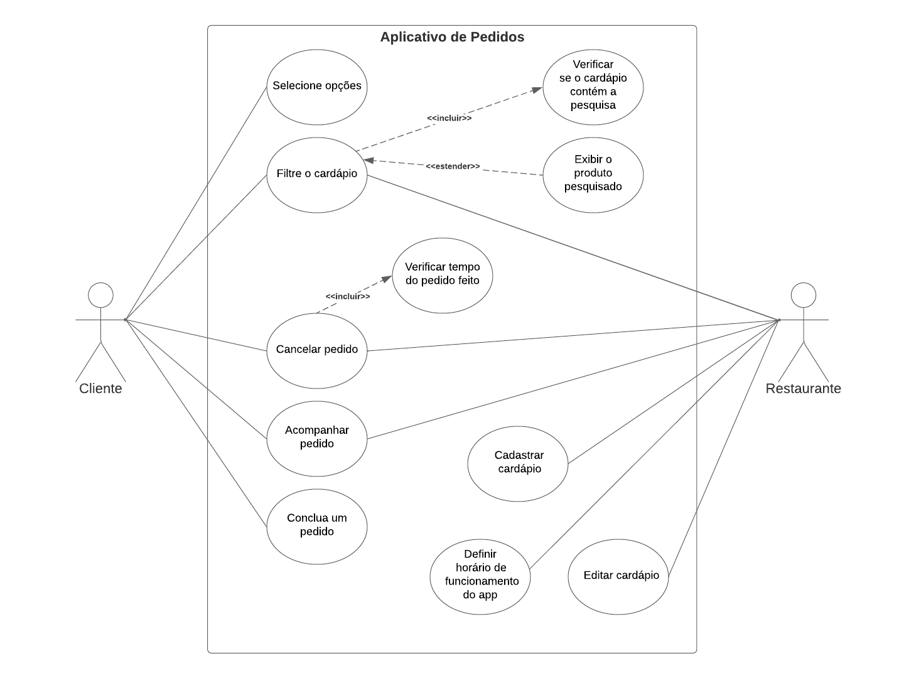

# Especificações do Projeto

Pré-requisitos: <a href="1-Documentação de Contexto.md"> Documentação de Contexto</a>

## Personas

<b>Persona 1: Chef Carlos</b>

Função: Chefe de Cozinha  
Descrição: Carlos é um chef experiente e apaixonado pela culinária. Ele é responsável por supervisionar a cozinha, criar novos pratos e garantir a qualidade dos alimentos. Sua rotina é agitada e ele está sempre em busca de maneiras de otimizar o processo de preparação de alimentos.  
Necessidades e Metas:
Receber pedidos claros e detalhados da cozinha.
Acesso rápido ao registro de pedidos para referência.
Notificações em tempo real sobre pedidos urgentes ou alterações.
Interface intuitiva para atualizar o status dos pratos.

<b>Persona 2: Garçonete Ana</b>

Função: Atendente de Garçom 
Descrição: Ana é uma atendente amigável e eficiente. Ela interage diretamente com os clientes, anota os pedidos e garante que a experiência de jantar seja agradável. Ela lida com vários pedidos ao mesmo tempo, enquanto mantém um bom atendimento ao cliente. 
Necessidades e Metas:
Receber notificações imediatas sobre novos pedidos ou alterações.
Acessar informações detalhadas sobre os pratos (ingredientes, alergias etc.).
Rápido registro de pedidos e atualizações em tempo real.
Comunicar-se facilmente com a cozinha para feedback ou correções.

<b>Persona 3: Gerente Gabriela</b>

Função: Gerente do Restaurante 
Descrição: Gabriela é responsável pela operação geral do restaurante. Ela supervisiona a equipe, monitora o desempenho e toma decisões estratégicas para melhorar a eficiência e a experiência do cliente. Ela precisa de informações claras para tomar decisões embasadas. 
Necessidades e Metas:
Painel de controle com métricas de desempenho da equipe e do restaurante.
Acesso a relatórios de vendas, horários de pico e pratos mais populares.
Capacidade de ajustar o fluxo de pedidos com base na demanda.
Monitorar o status das mesas, pedidos e tempos de espera.

<b>Persona 4: Cliente Lucas</b>

Função: Cliente Regular 
Descrição: Lucas é um cliente frequente do restaurante. Ele valoriza a eficiência no atendimento e a qualidade dos alimentos. Gosta de fazer pedidos personalizados e prefere a comodidade de um serviço rápido e preciso. 
Necessidades e Metas:
Menu digital intuitivo e fácil de navegar.
Opções para personalizar pedidos e fazer solicitações especiais.
Receber atualizações sobre o status do pedido e tempo estimado.
Possibilidade de fornecer feedback sobre a experiência.

## Histórias de Usuários

Com base na análise das personas foram identificadas as seguintes histórias de usuários:

|EU COMO... `PERSONA`| QUERO/PRECISO ... `FUNCIONALIDADE`      |PARA ... `MOTIVO/VALOR`                         |
|--------------------|------------------------------------     |----------------------------------------        |
|Cliente             | visualizar o cardápio                   | fazer o pedido                                 |
|Cliente             | selecionar ingredientes/tamanhos/opções | experiência personalizada                      |
|Cliente             | chamar garçom na mesa                   | tirar alguma dúvida ou alterar pedido          |
|Cliente             | avaliar o pedido                        | dar feedback ao restaurante                    | 
|Garçom              | acompanhar o status dos pedidos         | levar pedidos até as mesas                     |
|Garçom              | receber aviso de qual mesa o solicitou  | ir até a mesa e atender o cliente pessoalmente |
|Administrador       | alterar permissões                      | Permitir que possam administrar contas         |
|Administrador       | alterar prazos e itens do cardápio      | personalizar de acordo com o estabelecimento   |
|Equipe da Cozinha   | visualizar a fila de pedidos            | planejar a preparação dos pedidos              |
|Equipe da Cozinha   | alterar o status dos pedidos            | ter controle visual dos pedidos (quadro kanbam)|
|Equipe da Cozinha   | visualizar a receita (ficha técnica)    | manter o padrão de qualidade da comida         |

## Modelagem do Processo de Negócio 

### Análise da Situação Atual

Apresente aqui os problemas existentes que viabilizam sua proposta. Apresente o modelo do sistema como ele funciona hoje. Caso sua proposta seja inovadora e não existam processos claramente definidos, apresente como as tarefas que o seu sistema pretende implementar são executadas atualmente, mesmo que não se utilize tecnologia computacional. 

### Descrição Geral da Proposta

Apresente aqui uma descrição da sua proposta abordando seus limites e suas ligações com as estratégias e objetivos do negócio. Apresente aqui as oportunidades de melhorias.

### Processo 1 – NOME DO PROCESSO

Apresente aqui o nome e as oportunidades de melhorias para o processo 1. Em seguida, apresente o modelo do processo 1, descrito no padrão BPMN. 

### Processo 2 – NOME DO PROCESSO

Apresente aqui o nome e as oportunidades de melhorias para o processo 2. Em seguida, apresente o modelo do processo 2, descrito no padrão BPMN.

## Indicadores de Desempenho

Apresente aqui os principais indicadores de desempenho e algumas metas para o processo. Atenção: as informações necessárias para gerar os indicadores devem estar contempladas no diagrama de classe. Colocar no mínimo 5 indicadores. 

Usar o seguinte modelo: 

Obs.: todas as informações para gerar os indicadores devem estar no diagrama de classe a ser apresentado a posteriori. 

## Requisitos

As tabelas que se seguem apresentam os requisitos funcionais e não funcionais que detalham o escopo do projeto. Para determinar a prioridade de requisitos, aplicar uma técnica de priorização de requisitos e detalhar como a técnica foi aplicada.

### Requisitos Funcionais

|ID    | Descrição do Requisito  | Prioridade |
|------|-----------------------------------------|----|
|RF-01| A aplicação deve disponibilizar o cardápio do estabelecimento | ALTA | 
|RF-02| A aplicação deve disponibilizar filtros de pesquisa do cardápio para o cliente   | BAIXO |
|RF-03| A aplicação deve permitir que o cliente selecione, conclua  | ALTA |
|RF-04| A aplicação deve permitir que o cliente acompanhe o estado pedido  | MEDIA |
|RF-05| A aplicação deve permitir que o cliente altere ou cancele o pedido por um tempo determinado pelo estabelecimento | ALTA |
|RF-06| A aplicação deve permitir que a cozinha do estabelecimento receba e ordene os pedidos. | ALTA |
|RF-07| A aplicação deve permitir que a cozinha filtre os pedidos por categoria. | BAIXO |
|RF-08| A aplicação deve permitir que estabelecimentos parceiros cadastrem e alterem o seu cardápio (preço, opções)  | ALTA |
|RF-09| A aplicação deve permitir que o Gerente/Administrador defina o horário de funcionamento do restaurante   | MEDIA |

### Requisitos não Funcionais

|ID     | Descrição do Requisito  |Prioridade |
|-------|-------------------------|----|
|RNF-01| O sistema deve ser responsivo, permitindo a visualização em diferentes tamanhos de telas. | ALTA | 
|RNF-02| O sistema deve garantir a privacidade e a segurança das informações dos usuários |  ALTA | 
|RNF-03| O sistema deve ser fácil de manter, atualizar e corrigir, sem afetar a disponibilidade ou a qualidade do serviço |  ALTA | 
|RNF-04| O sistema deve ser compatível com os principais sistemas operacionais (Android e o iOS) |  ALTA | 
|RNF-05| O sistema deve não funcionará com delivery. |  ALTA | 

## Restrições

O projeto está restrito pelos itens apresentados na tabela a seguir.

|ID| Restrição                                             |
|--|-------------------------------------------------------|
|RE-01| O projeto deverá ser entregue no final do semestre letivo, não podendo extrapolar a data de 04/12/2023 |
|RE-02| O sistema deve se restringir ao uso da biblioteca React Native |
|RE-03| A equipe não pode subcontratar o desenvolvimento do trabalho |

## Diagrama de Casos de Uso

O diagrama de casos de uso é o próximo passo após a elicitação de requisitos, que utiliza um modelo gráfico e uma tabela com as descrições sucintas dos casos de uso e dos atores. Ele contempla a fronteira do sistema e o detalhamento dos requisitos funcionais com a indicação dos atores, casos de uso e seus relacionamentos. 

# Matriz de Rastreabilidade

A matriz de rastreabilidade é uma ferramenta usada para facilitar a visualização dos relacionamento entre requisitos e outros artefatos ou objetos, permitindo a rastreabilidade entre os requisitos e os objetivos de negócio. 

A matriz deve contemplar todos os elementos relevantes que fazem parte do sistema, conforme a figura meramente ilustrativa apresentada a seguir.

> **Links Úteis**:
> - [Artigo Engenharia de Software 13 - Rastreabilidade](https://www.devmedia.com.br/artigo-engenharia-de-software-13-rastreabilidade/12822/)
> - [Verificação da rastreabilidade de requisitos usando a integração do IBM Rational RequisitePro e do IBM ClearQuest Test Manager](https://developer.ibm.com/br/tutorials/requirementstraceabilityverificationusingrrpandcctm/)
> - [IBM Engineering Lifecycle Optimization – Publishing](https://www.ibm.com/br-pt/products/engineering-lifecycle-optimization/publishing/)

# Gerenciamento de Projeto

De acordo com o PMBoK v6 as dez áreas que constituem os pilares para gerenciar projetos, e que caracterizam a multidisciplinaridade envolvida, são: Integração, Escopo, Cronograma (Tempo), Custos, Qualidade, Recursos, Comunicações, Riscos, Aquisições, Partes Interessadas. Para desenvolver projetos um profissional deve se preocupar em gerenciar todas essas dez áreas. Elas se complementam e se relacionam, de tal forma que não se deve apenas examinar uma área de forma estanque. É preciso considerar, por exemplo, que as áreas de Escopo, Cronograma e Custos estão muito relacionadas. Assim, se eu amplio o escopo de um projeto eu posso afetar seu cronograma e seus custos.

## Gerenciamento de Tempo e Gerenciamento de Equipe

Com diagramas bem organizados que permitem gerenciar o tempo nos projetos, o gerente de projetos agenda e coordena tarefas dentro de um projeto para estimar o tempo necessário de conclusão.

O gráfico de Gantt ou diagrama de Gantt também é uma ferramenta visual utilizada para controlar e gerenciar o cronograma de atividades de um projeto. Com ele, é possível listar tudo que precisa ser feito para colocar o projeto em prática, dividir em atividades e estimar o tempo necessário para executá-las.

O gerenciamento adequado de tarefas contribuirá para que o projeto alcance altos níveis de produtividade. Por isso, é fundamental que ocorra a gestão de tarefas e de pessoas, de modo que os times envolvidos no projeto possam ser facilmente gerenciados.

Conforme a figura a seguir definimos o gerenciamento de tempo e equipe para o projeto:

## Gestão de Orçamento

O processo de determinar o orçamento do projeto é uma tarefa que depende, além dos produtos (saídas) dos processos anteriores do gerenciamento de custos, também de produtos oferecidos por outros processos de gerenciamento, como o escopo e o tempo.

Conforme a figura a seguir está definidio o orçamento necessário para o desenvolvimento do projeto:

