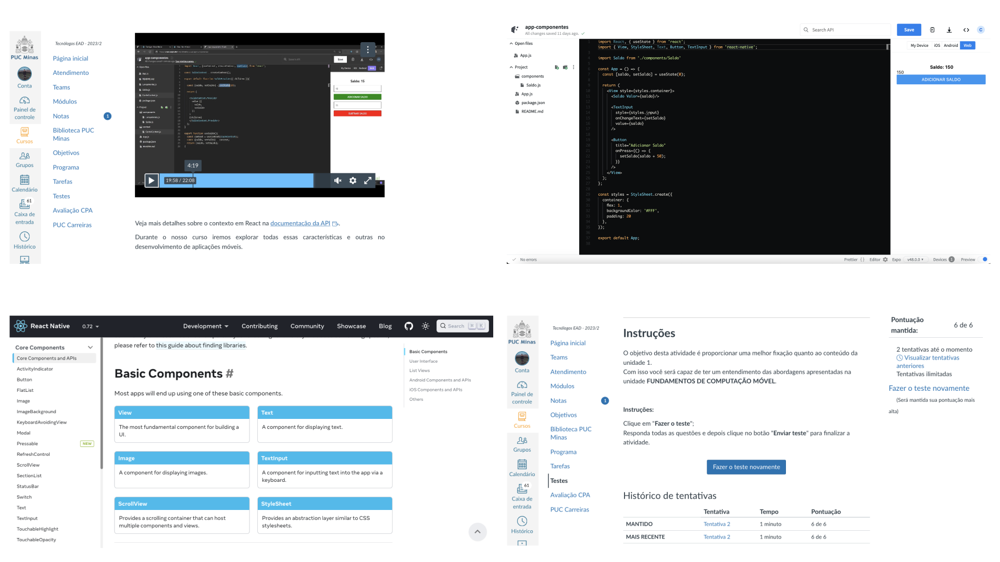

# Programação de Funcionalidades

Pré-requisitos: <a href="2-Especificação do Projeto.md"> Especificação do Projeto</a>, <a href="3-Projeto de Interface.md"> Projeto de Interface</a>, <a href="4-Metodologia.md"> Metodologia</a>, <a href="3-Projeto de Interface.md"> Projeto de Interface</a>, <a href="5-Arquitetura da Solução.md"> Arquitetura da Solução</a>

Implementação do sistema descritas por meio dos requisitos funcionais e/ou não funcionais. Deve relacionar os requisitos atendidos os artefatos criados (código fonte) além das estruturas de dados utilizadas e as instruções para acesso e verificação da implementação que deve estar funcional no ambiente de hospedagem.

Para cada requisito funcional, pode ser entregue um artefato desse tipo

> **Links Úteis**:
>
> - [Trabalhando com HTML5 Local Storage e JSON](https://www.devmedia.com.br/trabalhando-com-html5-local-storage-e-json/29045)
> - [JSON Tutorial](https://www.w3resource.com/JSON)
> - [JSON Data Set Sample](https://opensource.adobe.com/Spry/samples/data_region/JSONDataSetSample.html)
> - [JSON - Introduction (W3Schools)](https://www.w3schools.com/js/js_json_intro.asp)
> - [JSON Tutorial (TutorialsPoint)](https://www.tutorialspoint.com/json/index.htm)

## Tela Favoritos

Sendo desenvolvida por Cláudio Lopes Coelho Barroso.  
Iniciei os estudos do Micro Fundamento de Desenvolvimento de Aplicações Móveis na Segunda feira 09/10/23.  
Foi finalizado toda a unidade 1 juntamente com a execução de todos os passos dados pelo professor. Segue algumas evidências: 

Conhecendo o react native paper e suas possibilidade na criação de intefaces.

Aprendendo sobre o componente contexto.

A aplicação principal App.js no ambiente de desenvolvimento snack.expo.dev e o exercicio final da unidade 1.

## Tela Inicial
Sendo desenvolvida por Fernando de Araújo Abreu. 
Iniciei os estudos do Micro Fundamento de Desenvolvimento de Aplicações Móveis na Terça-feira 10/10/23.  
Foi finalizado toda a unidade 1 juntamente com a execução de todos os passos dados pelo professor. Segue algumas evidências: 

A aplicação principal App.js no ambiente de desenvolvimento snack.expo.dev e o exercicio final da unidade 1.

## Tela Menu
Desenvolvimento por Gabriel Costa de Cerqueira Bispo. 
Iniciei o estudo do Micro Fundamento - Desenvolvimento de Aplicações Móveis no início dessa etapa e executei o passo a passo junto com o professor, buscando referências e complementações na documentação do react. No momento estou na Unidade 2, conhecendo as principais características dos mecanismos de navegação e criação de rotas no react native. 

## Tela Home

Sendo desenvolvida por Felipe Sobrinho.  
Estudos iniciados ao início da etapa 3, sendo realizados os projetos do Micro Fundamento junto ao professor e complementando os estudos com as documentações de cada tecnologia. Atualmente, ja finalizei o projeto proposto para a Unidade 1 e estou gradualmente realizando o projeto da Unidade 2.  
**Seguem algumas prints de código e vídeos dos projetos rodando no Expo Go do dispositivo móvel:**

https://github.com/ICEI-PUC-Minas-PMV-ADS/pmv-ads-2023-2-e3-proj-mov-t1-CardAppio/assets/63524496/1972d1ea-9e3d-48cc-b7bc-258ae349c507

https://github.com/ICEI-PUC-Minas-PMV-ADS/pmv-ads-2023-2-e3-proj-mov-t1-CardAppio/assets/63524496/c2fcd4f6-78c9-4234-9ab2-f2b59a334d71

## Tela Carrinho

Sendo desenvolvida por João Marcos Macedo.   
Estou finalizando os estudos da Unidade 1 do Microfundamento de Desenvolvimento de Aplicações Móveis. Estou sendo introduzindo ao Expo e estudando as funcionalidades da plataforma. Tela do aplicativo bem no ínicio do desenvolvimento.   

